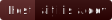
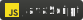
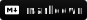
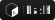
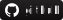

<meta name="description" content="aitji.is-a.dev – addon hub, where you can download all my addons for free! check out my latest creations and stay updated.">
<link rel="canonical" href="https://aitji.is-a.dev" />

  <a href="#aitji" title="@aitji hello i'm aitji, a full-stack software developer">
    <picture>
      
    </picture>
  </a>

  <!-- discord badge -->
  <a href="https://discord.gg/NVYrkFWrQh" title="join my discord">
    <picture>
      
    </picture>
  </a>

  <!-- addonhub badge -->
  <a href="https://aitji.is-a.dev" title="visit my addon hub">
    <picture>
      
    </picture>
  </a>

  <!-- email badge -->
  <a href="mailto:aitji@duck.com" title="send me an email">
    <picture>
      
    </picture>
  </a>

  
i'm <a title="@aitji's website" href="https://aitji.is-a.dev">@aitji</a>, a full-stack developer who like the silly sand block gamebedrock edition

 

  <h2>languages & tech stacks...</h2>
  

    <a title="html" href="#"><picture></picture></a>
    <a title="css" href="#"><picture></picture></a>
    <a title="bootstrap" href="#"><picture></picture></a>
    <a title="javascript" href="#"><picture></picture></a>
    <a title="typescript" href="#"><picture></picture></a>
    <a title="python" href="#"><picture></picture></a>
    <a title="php" href="#"><picture></picture></a>
    <a title="nodejs" href="#"><picture></picture></a>
    <a title="markdown" href="#"><picture></picture></a>
    <a title="powershell" href="#"><picture></picture></a>
    <a title="bash" href="#"><picture></picture></a>
    <a title="github" href="#"><picture></picture></a>
    <a title="vscode" href="#"><picture></picture></a>
  

 

  <h2>social...</h2>
  <a title="youtube" href="https://www.youtube.com/@aitji."><picture></picture></a>
  <a title="discord profile" href="https://discord.com/users/660742557009051659"><picture></picture></a>
  <a title="github" href="https://github.com/aitji"><picture></picture></a>
  <a title="linkedin" href="https://www.linkedin.com/in/aitji/"><picture></picture></a>
  <a title="twitch" href="https://twitch.tv/aitji"><picture></picture></a>
  <a title="x / twitter" href="https://x.com/aitji_dev"><picture></picture></a>
  <a title="reddit" href="https://www.reddit.com/user/aitji"><picture></picture></a>

 

  <h2>project...</h2>

  <table>
    <thead>
      <tr>
        <th>project</th>
        <th>description</th>
        <th>status</th>
      </tr>
    </thead>
    <tbody>
      <tr>
        <td><a href="https://thatako.net">thatako.net</a></td>
        <td>not really plan but it up.</td>
        <td>active</td>
      </tr>
      <tr>
        <td><a href="https://pr.thatako.net">pr.thatako</a></td>
        <td>public relations for thatako phitthayakhom school. maintenance until 2027.</td>
        <td>active</td>
      </tr>
      <tr>
        <td><a href="#">field trip 4/1 (2024)</a></td>
        <td>song requests for the 4/1 field trip.</td>
        <td>inactive</td>
      </tr>
      <tr>
        <td><a href="https://aitji.is-a.dev/">addon hub</a></td>
        <td>share my addons with my audience.</td>
        <td>active</td>
      </tr>
      <tr>
        <td><a href="https://cmgmmo.vercel.app/">cmgmmo</a></td>
        <td>discontinued minecraft server site.</td>
        <td>discontinued</td>
      </tr>
      <tr>
        <td><a href="https://thatako-council.com">thatako-council</a></td>
        <td>a thatako phitthayakhom student council site (year 2025).</td>
        <td>active</td>
      </tr>
    </tbody>
  </table>

 

  <h2>statistics...</h2>
  

    

      <!--START_SECTION:age-->

``3y 11m 29d``
      <!--END_SECTION:age-->
  

  <a href="#aitji" title="github visit counter">
    <picture>
      
    </picture>
  </a>
  

    <a href="#aitji" title="github streak stats">
      <picture>
        
      </picture>
    </a>
  

  <picture>
    <source media="(prefers-color-scheme: dark)" srcset="https://raw.githubusercontent.com/aitji/aitji/output/github-snake-dark.svg">
    <source media="(prefers-color-scheme: light)" srcset="https://raw.githubusercontent.com/aitji/aitji/output/github-snake.svg">
    
  </picture>

 

  <a href="#aitji" title="email preferred">
    <picture>
      
    </picture>
  </a>

